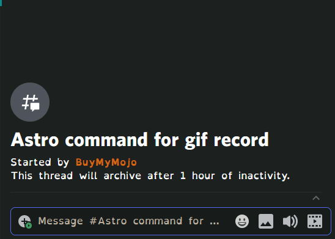
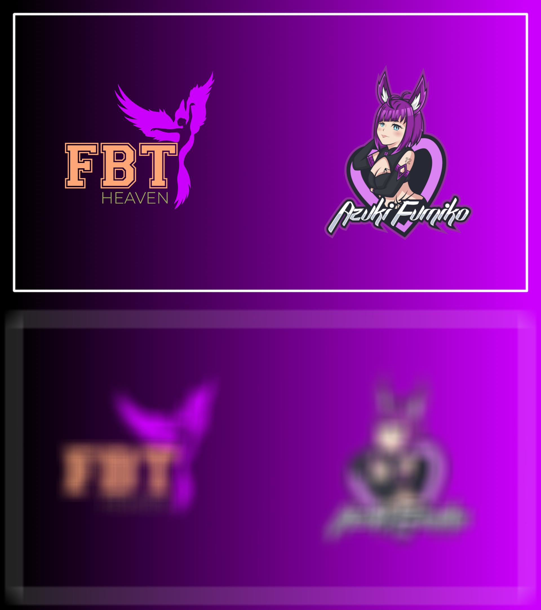
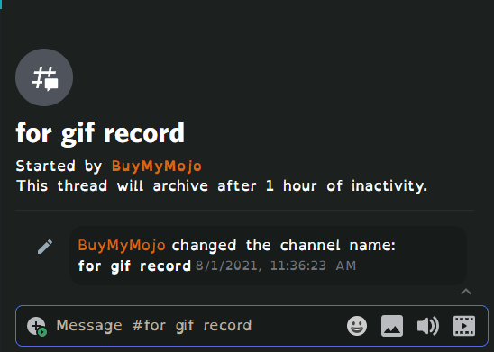
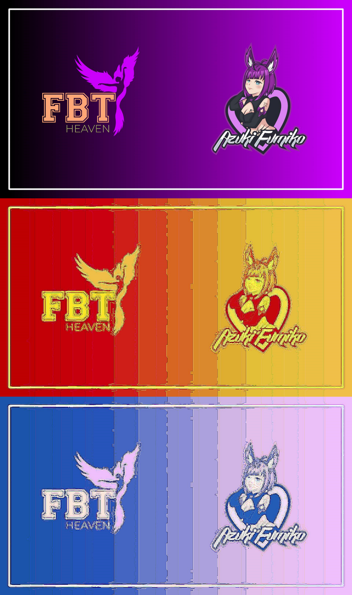
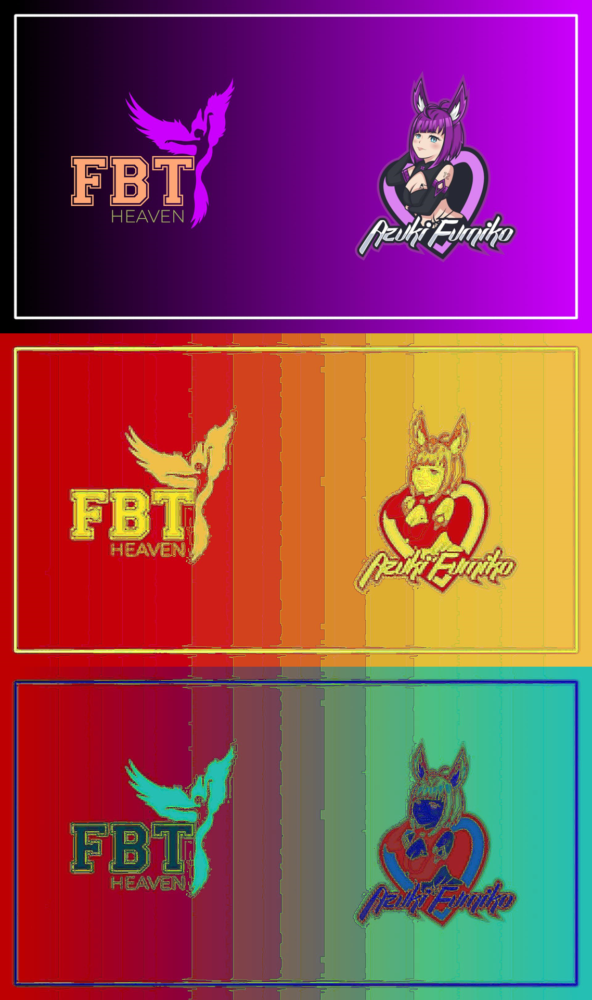

# FBT-bot docs
FBT-bot or FBT-security is a discord bot deveoped by [BuyMyMojo](https://github.com/BuyMyMojo) and [TSMRE](https://github.com/TSMRE) for the VRChat group FBT Heaven

## Documentation:

### Commands:

> `command|alias1|alias2 [These are required] {These are optional}

#### help
Displays the link to this page :3

> `help

#### Angie
For when you're mad

> `angie|angry|mad

#### Astro
Will basically 'sing' Astronaut in the Ocean in chat

> `astro

#### Avatar
Displays the current user or mentioned user's discord avatar

> `avatar {Optional @user}

#### Based
on what? Based on your based stats of course!

Sends the based stats for a member

> `based [@user]

#### Bite
Bite another user or yourself

> `bite|chmomp|nom {@user}

#### Bonk
Bonk someone real hard!

> `bonk {@user}

#### Boop
Boop someone right on the nose

> `Boop {@user}

#### Bored
Show just how bored you are

> `bored

#### Bounce
booba oo

> `bounce|booba|boobies|tatas

#### Censor
Blurs out whatever image is given

> `censor [URL to image]

#### Cringe
Yep that's going in the cringe compilation 

> `cringe {Optional @user}

#### Danbooru
Get a SFW image from danbooru

> `danbooru [tag(s)]

#### Dance
Dance alone or with a partner!

> `dance {@user}

#### Discord_add or da
Add a users Discord ID to the security list

> `discord_add [Discord User ID] {Optional URL to image (if none put 0)} {Optional reason}
> 
> `da [Discord User ID] {Optional URL to image (if none put 0)} {Optional reason}

#### Drink
Stay hydrated!

> `drink|glug|gulp

#### Eat
Food is tasty

> `eat

#### Feedback
Have feedback? feel free to tell us with this!

> `feedback [Feedback]

#### Femboy
You get a SFW femboy image, what else do you want?

> `femboy

#### Femboy_danbooru
You get a random SFW femboy image taken from the danbooru website

> `femboy_danbooru

#### Fry
Deepfry supplied image.

> `fry [URL to image] {Optionaly put the word "blue" here for a blue output}

[full](Fry.png)

#### Imgdif
Generates a difference map from two images of the same resolution

> `imgdif [URL to image 1] [URL to image 2] {Optionally put the letter b here to brighten the output}

[full](imgdif.png)

#### Imgur
reupload image to imgur.
This was a test command but I left it in for fun ~ mojo

> `imgur [URL to image]

#### Kiss
Kiss someone you like a lot... or yourself if you're lonely

> `kiss|makeout|snog {@user}

#### Kitten
See if you can make someone your discord kitten

> `kitten {@user}

#### kpop
This was added by TSMRE... blame him

> `kpop

#### Lazy
Show just how lazy you feel

> `lazy

#### Lewd
Wow that's lewd!

> `lewd {@user}

#### Lick
Lick someone to mark them as yours!

> `lick|taste {@user}

#### owo
Make your text all OwO

> `owo [Any text at all]

#### Pat
Pat someone c:

or just get a pat gif

> `pat {@user}

#### permafur
Get's a permanent result on how much of a furry you are. You are stuck with the result forever!

> `permafur {@user}

#### Pinch
Pinch someone because you can or pinch yourself to see if you're dreaming

> `pinch {@user}

#### Poke
Poke someone or yourself

> `poke {@user}

#### Pomf
like Astro but a lot worse.

Thank me for this later ~ mojo

> `pomf

#### Punch
Time to get into a fight!

> `punch {@user}

#### Puppy
Sends a random puppy image

> `puppy

#### randship
Like ship but always get a random result!

> `randship [@user1] [@user2]

#### Servericon
Get current server icon

> `servericon

#### Ship
Ship any two members and have their result permanently remembered!

> `ship [@user1] [@user2]

#### Shoot
Time to end a fight.. or yourself

> `shoot|bang {@user}

#### Slap
Slap someone silly

> `slap {@user}

#### Sleepy
Anyone else getting tired?

> `sleepy|tired

#### Song
Sends a random song that is Suzuki Approved™

> `song

#### Systeminfo
Show the hardware the bot is running on

> `systeminfo

#### Testplt
This was another test I left in. fear that the bot can do math, it means it's nearly sentient! ~ mojo

> `testplt

#### Toxic
Damn that's toxic

> `toxic {@user}

#### Tanslate
Translates your text into any supported language

> `translate [lang code] [text]

#### vrc_add or va
Like discord_add but for vrc info

> `vrc_add [Discord User ID] {Optional URL to image (if none put 0)} {Optional reason}
> 
> `va [Discord User ID] {Optional URL to image (if none put 0)} {Optional reason}

#### Vrc user info
Get some info about a VRChat user

> `vrcuserinfo [VRC user ID]

#### Vrc world info
Get some info about a VRChat world

> `vrcworldinfo [VRC wolrd ID]

#### Waifu
Sends a random (SFW) waifu image, can specify a type

> `waifu {type}

## Info:

### FBT Heaven links:
Azuki Fumiko Twitch: https://www.twitch.tv/azuki_fumiko/

Instagram: https://www.instagram.com/officialfbtheaven/

Twitter: https://twitter.com/FBTHeavenVRC/

YouTube: https://www.youtube.com/channel/UCX9Poe22zs32S6uLKTflZRg/

### Other clubs using FBT bot:
coming soon!

## $upport:

### FBT:
Patreon: https://www.patreon.com/azukifumiko

### Devs:
Maybe one day, if Azuki let's us out of the basement!

[Mojo](https://www.patreon.com/buymymojo) - thanks bros

[TSMRE](https://www.patreon.com/hststudios) - Look at this game dev go
